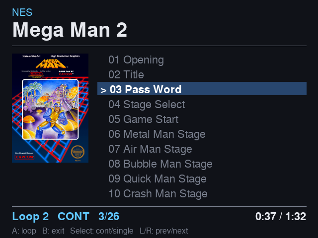
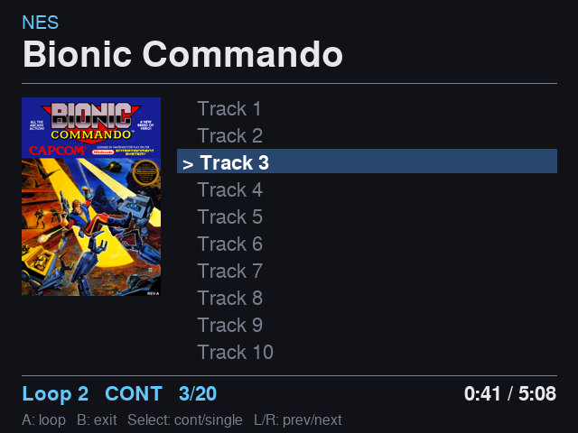

# RetroPie Game Music Player

A graphical chiptune/VGM **music player** for [RetroPie](https://retropie.org.uk/)
/ EmulationStation. It adds a **Game Music** system to EmulationStation and plays
video-game sound rips — VGM/VGZ, NSF, GBS, SPC and more — through a controller-driven
jukebox UI with box art, a track list, loop control and gapless navigation.

Built for the [RetroFlag GPi Case 2W](https://retroflag.com/) (Pi Zero 2 W,
640×480 screen, no keyboard) but works on standard RetroPie builds on Raspberry
Pi 3 / 4 / 5.



## Why

RetroPie has no built-in way to just *listen* to game music. Libretro's
`lr-gme` core plays some formats but only inside RetroArch (no playlist, no art,
no loop control), and it can't synthesize the arcade/Genesis chips that VGM rips
use. This project gives you a real jukebox:

- **Multiple engines, picked automatically by file type:**
  - `vgmjuke` (built on **[libvgm](https://github.com/ValleyBell/libvgm)**) plays
    register-log formats — **VGM / VGZ / GYM / S98 / DRO** — with full chip support
    (YM2151, YM2612, SN76489, RF5C68, SegaPCM, …) for arcade, Genesis and Master
    System music.
  - `gmejuke` (built on **[libgme / game-music-emu](https://github.com/libgme/game-music-emu)**)
    plays CPU-emulated formats — **NSF / NSFE / GBS / SPC / AY / HES / KSS / SAP**.
  - `modjuke` (built on **[libopenmpt](https://lib.openmpt.org/libopenmpt/)**)
    plays Amiga/tracker modules — **MOD / XM / S3M / IT / MED / AHX / …**.
  - `sidjuke` (built on **[libsidplayfp](https://github.com/libsidplayfp/libsidplayfp)**)
    plays Commodore 64 **SID / PSID** (multi-subtune, like NSF).
  - `gmjuke` (built on **[FluidSynth](https://www.fluidsynth.org/)**) plays
    General MIDI **MID / MIDI** using an SC-55-style GM SoundFont you supply
    (this is the authentic playback path for AWE32/GM-era DOS & Windows game music).

  The last three wrap apt-packaged libraries and are **optional / fail-soft**:
  if a library or SoundFont is missing, that engine is skipped and its formats
  simply don't appear — the core VGM/GME engines are unaffected.
- **SNES `.rsn` support.** SNES sets ship as `.rsn` (a RAR of `.spc` + `info.txt`).
  The player unpacks them on launch (via `unar`) and plays the SPCs as an album —
  drop `.rsn` files in as-downloaded, no manual extraction.
- **Folder = album.** Selecting a track queues every track in its folder. Track
  names come from the **filenames**, so file-per-song formats (VGZ/VGM/GYM/…) show
  real track titles. **SPC** files show their **ID666 song title**; **NSF and other
  multi-subtune files** store no per-track names, so their subtunes show as numbered
  entries (*Track 1…N*).
- **Box art** — per-album `folder.png` (preferred), else reused from your existing
  console systems' scraped art (`roms/nes/images`, …). `tools/fetch-art.py` can
  fill gaps from libretro-thumbnails. The player only *displays* art, never fetches
  at runtime.
- **Four play modes** (cycle with Select): **Single**, **Album**, **All** (roll into
  the next folder at album end), **Shuffle** (jump to a random folder) — plus live
  loop control and prev/next, all from the pad.

## Controls

| Button | Action |
|---|---|
| **A** | Cycle loop mode: ∞ → 0 → 1 → 2 → 3 → 4 (live, no restart) |
| **B** | Exit to the menu |
| **Select** | Cycle play mode: **Single** → **Album** → **All** (roll into next folder) → **Shuffle** (jump to a random folder) |
| **L / R shoulders** | Previous / next track |

On first launch an **on-screen setup wizard** captures your controller's button
numbers (it varies by pad) and saves them next to the player.

## Requirements

- RetroPie / EmulationStation on Raspberry Pi OS (Raspbian).
- A gamepad and a framebuffer display (`/dev/fb0`) — both standard on RetroPie.
- Build tools and Pillow, installed automatically by `install.sh`:
  `build-essential cmake git libasound2-dev zlib1g-dev python3 python3-pil fonts-freefont-ttf`.

> **libvgm and libgme are prerequisites**, but you do **not** install them by
> hand and they are **not** bundled here — `install.sh` clones and compiles them
> locally (they have their own licenses).

The optional MOD/SID/MIDI engines use apt-packaged libraries that `install.sh`
adds automatically (`libopenmpt-dev libsidplayfp-dev libfluidsynth-dev`); if any
are unavailable the build skips just that engine. **MIDI needs a General MIDI
SoundFont** — drop an SC-55-style `.sf2` in
`/opt/retropie/emulators/gamemusic/soundfonts/` (or set `$GMJUKE_SF2`); until you
do, `.mid` files stay silent. If a `.mid` has an identically-named `.sf2` beside
it, `gmjuke` loads it into bank 1 for AWE32-style MIDI+SoundFont pairs.

## Install

```sh
git clone https://github.com/nsputnik/retropie-game-music-player
cd retropie-game-music-player
./install.sh
```

This builds libvgm + libgme, compiles the two engines, installs the player to
`/opt/retropie/emulators/gamemusic/`, and registers the **Game Music** (`gme`)
system in EmulationStation. Paths can be overridden with environment variables
(`INSTALL_DIR`, `ROMS`, `RP`, `SRC`, `ES_SYSTEMS`) — see the top of `install.sh`.

## Adding music

Drop rips under the `gme` roms folder, organised as `Category/Album/tracks`:

```
~/RetroPie/roms/gme/
├── Arcade/Rastan (Arcade)/01 - Aggressive World.vgz
├── Genesis/Sonic the Hedgehog/01 Title.vgz
├── Master System/Phantasy Star (FM)/01 Title.vgm
├── NES/Mega Man 2 (NES)/01 Opening.vgz
├── NES/Bionic Commando (NES)/Bionic Commando (NES).nsf   # multi-subtune file
├── SNES/Chrono Trigger (SNES).rsn                        # RAR of .spc (auto-unpacked)
└── AdLib/Games/Dune/01 Sietch.vgz                        # OPL2 (.vgz/.vgm)
```

Restart EmulationStation to register new files. Good sources: rips from
[vgmrips.net](https://vgmrips.net/), [smspower.org](https://www.smspower.org/),
and NSFs from [Zophar's Domain](https://www.zophar.net/music).



*An NSF album: its subtunes appear as numbered tracks (**Track 1…N**) because the
NSF format stores no per-track names — unlike the file-per-song formats above,
where each song's filename becomes its title.*

## Box art

The player resolves art in this order, **all from local files** — it never
fetches anything:

1. A per-album image in the album folder (`folder.png` / `box.png` / `cover.png`).
2. The matching console system's scraped art: `Category` → RetroPie system, e.g.
   `NES → roms/nes/images`, `Genesis → roms/megadrive/images`,
   `Master System → roms/mastersystem/images`, `Arcade → roms/arcade/images`.

So if your console systems are already scraped (Skyscraper, the built-in
scraper, etc.), the music gets art for free.

### Optional helpers (`tools/`)

Standalone, run-by-hand utilities — **not** part of the player runtime.

Box art (from [libretro-thumbnails](https://github.com/libretro-thumbnails), no
account/key):

- **`fetch-art.py`** — download a cover (`folder.png`) into each music album that
  has none. Handles nested categories and tries multiple thumbnail systems per
  album (e.g. AdLib → DOS/MAME/FBNeo); `--category X` restricts the run.
- **`scrape-system.py`** — fetch art + build a gamelist for a whole console ROM
  system (e.g. Master System).
- **`make-gamelist.py`** — write `<image>` tags into the `gme` gamelist so covers
  show while *browsing* the Game Music menu (run with EmulationStation stopped).

Library tidy-up:

- **`rename-rsn.py`** — rename SNES `.rsn` sets from their abbreviations
  (`smw.rsn`) to the real game title read from each archive's own `info.txt`
  (`Super Mario World (SNES).rsn`). Dry-run by default; `--apply` to rename. The
  `.rsn` files aren't unpacked or modified.
  `install.sh` also wires this into a **boot hook** (in `autostart.sh`) that runs
  it over `roms/gme/SNES` before EmulationStation loads — so newly-dropped
  abbreviated packs get titled automatically. It's idempotent and near-instant
  (already-titled files ending in `(SNES)` are skipped without being opened, so
  only new short-named packs are ever touched). To turn it off, delete the line
  marked `# gme: SNES .rsn auto-rename` from `autostart.sh`.

## How it works

```
EmulationStation (gme system)
  └─ runcommand → launch.sh %ROM%
       └─ jukebox.py            ← framebuffer UI + gamepad, builds the playlist
            ├─ vgmjuke <file>           (libvgm, register-log formats)
            └─ gmejuke --track N <file> (libgme, CPU-emulated formats)
```

`jukebox.py` owns the screen (draws to `/dev/fb0` with Pillow) and the gamepad
(`/dev/input/js0`). It spawns one engine process per track and talks to it over
stdin/stdout (`POS` position lines out; `loops`/`inf` loop-mode commands in).

## Caveats

- The UI **layout is tuned for 640×480** (the GPi screen). It adapts to the
  framebuffer size but on a 1080p HDMI screen elements look small/sparse —
  high-res scaling is a TODO.
- Draws directly to `/dev/fb0`; standard on RetroPie, but some KMS/Wayland
  setups may differ.
- On end-of-life Raspbian **Buster**, the apt mirror has moved — point
  `/etc/apt/sources.list` at `http://legacy.raspbian.org/raspbian/` if the
  dependency install 404s.

## Credits & license

- **[libvgm](https://github.com/ValleyBell/libvgm)** by ValleyBell — VGM playback engine.
- **[game-music-emu](https://github.com/libgme/game-music-emu)** — NSF/GBS/SPC/… playback (LGPL-2.1).
- **[libretro-thumbnails](https://github.com/libretro-thumbnails)** — box art source for the optional tools.

This project's own code is licensed **GPL-2.0** (see [LICENSE](LICENSE)). The
engines build against libvgm and libgme; distributed binaries are subject to
those libraries' terms.
